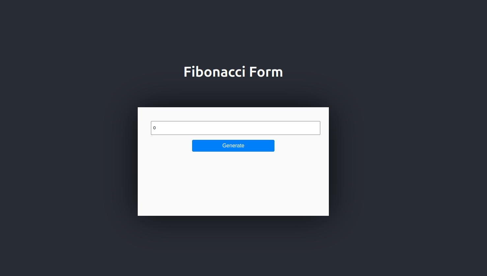
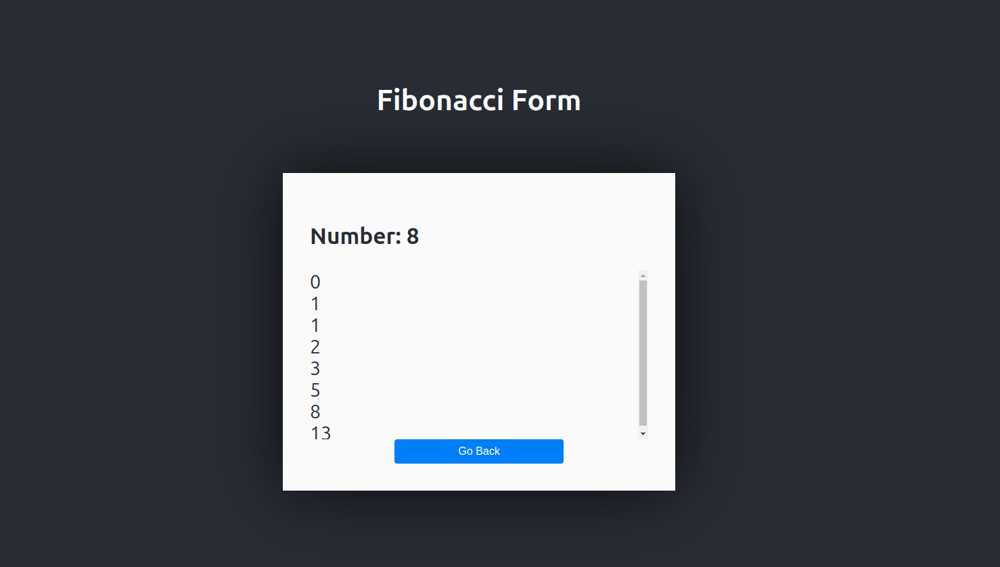

# Fibonacci APP

## Expected Screen

## Setting Up the Environment

First, copy the .env.example files to .env files in both the root and frontend folders.:

Root:

    cp .env.example .env

Frontend:

    cp frontend/.env.example frontend/.env

 

After copying the .env files, run docker-compose:

    docker-compose up --build

If everything worked fine, you'll be able to see the expected screen shown above, here:

    http://localhost:80

## Tests

To run the unit tests, you need to access the backend container:

    docker exec -it fibonacci-app_backend_1 /bin/bash

and run:

    pytest

Note: We currently have 5 tests (backend/fibonacci/tests/test_views.py).

## Structure:

### Backend:

1. Running into: 

    http://localhost:8000/

2. Using Python/Django;

### Frontend:

1. Running into

    http://localhost:80

2. Using React;